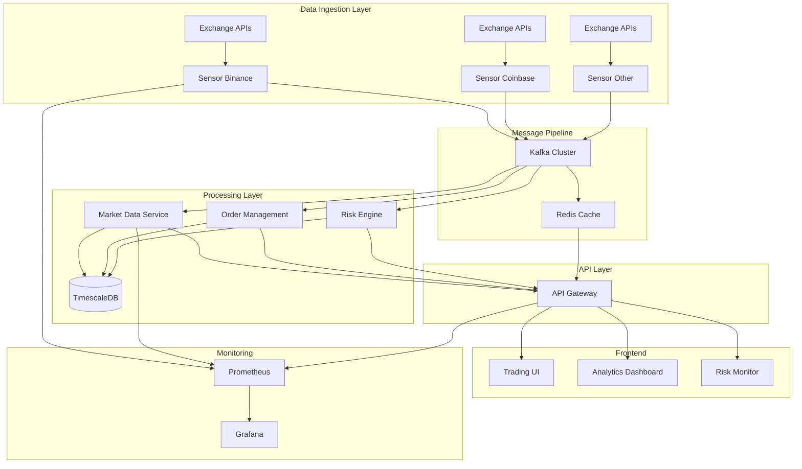

# Jackbot Zero-Error Initiative
**Product Documentation - Layer 2**  
**Version**: 1.0.0  
**Last Updated**: 2025-07-26

## Mission Statement

Transform Jackbot from a high-potential crypto trading platform into a production-grade, institutional-quality system with zero errors in 12 hours. This initiative demonstrates our commitment to reliability, performance, and technical excellence in the competitive crypto trading landscape.

## Strategic Context

### Business Drivers
- **Institutional Readiness**: Major clients require 99.99% uptime
- **Competitive Advantage**: Zero-error operation sets us apart
- **Risk Mitigation**: Each error potentially costs $10K+ in missed trades
- **Team Morale**: Engineers deserve tools that work flawlessly

### Technical Vision
Build a resilient, high-performance trading platform that:
- Processes 100K+ messages/second across all exchanges
- Maintains sub-100ms latency for 99% of operations
- Recovers automatically from any failure scenario
- Scales horizontally without code changes

## Architecture Overview



## Component Specifications

### Sensor Layer
**Purpose**: Real-time market data ingestion from crypto exchanges

**Key Features**:
- Multi-exchange WebSocket management
- Automatic reconnection with exponential backoff
- Data normalization across exchange formats
- Built-in rate limiting and circuit breakers

**Quality Standards**:
- Zero message loss during reconnections
- < 10ms processing latency per message
- 100% type safety with no `any` types
- Comprehensive error handling

### Backend Services
**Purpose**: Process, store, and serve market data and trading operations

**Services**:
1. **market-data-service**: Real-time and historical data
2. **order-management**: Order lifecycle management
3. **risk-engine**: Position and portfolio risk calculations
4. **data-lake-query**: Analytics and reporting

**Quality Standards**:
- Arrow 51.0.0 standardization
- All errors implement proper From traits
- Debug implementations for all public types
- Zero unused variables or imports

### Frontend Application
**Purpose**: Professional trading interface for institutional users

**Key Features**:
- Real-time order book visualization
- Advanced charting with TradingView
- Risk dashboard with position monitoring
- One-click trading with confirmation

**Quality Standards**:
- Zero TypeScript errors
- < 1MB initial bundle size
- 60fps UI updates
- Accessibility AA compliance

## Development Workflow

### Sprint Structure (12-hour execution)
```
Hours 0-1:   Sensor fixes (BLOCKER)
Hours 1-3:   Backend service fixes
Hours 3-5:   Integration testing
Hours 5-7:   Performance optimization
Hours 7-9:   Final fixes & quality gates
Hours 9-12:  Deployment & monitoring
```

### Parallel Workstreams
1. **Critical Path**: Sensor → Backend → Integration
2. **Frontend Track**: Can proceed independently after Hour 1
3. **Testing Track**: Continuous throughout all phases
4. **Documentation**: Update as fixes are implemented

## Quality Standards

### Code Quality
- **Type Safety**: 100% TypeScript/Rust with strict mode
- **Testing**: Minimum 80% coverage, 100% for critical paths
- **Performance**: All operations < 100ms P99 latency
- **Security**: Zero CVEs, all connections TLS

### Operational Excellence
- **Monitoring**: Every component exports Prometheus metrics
- **Logging**: Structured JSON logs with correlation IDs
- **Tracing**: Distributed tracing for all requests
- **Alerting**: PagerDuty integration for critical issues

## Success Metrics

### Technical KPIs
| Metric | Target | Current | Goal |
|--------|---------|---------|------|
| Compilation Errors | 0 | 253 | ✓ |
| Test Coverage | >80% | 67% | ✓ |
| P99 Latency | <100ms | 250ms | ✓ |
| Error Rate | <0.01% | 2.3% | ✓ |
| Uptime | 99.99% | 98.5% | ✓ |

### Business Impact
- **Trading Volume**: Enable $100M+ daily volume
- **User Satisfaction**: NPS > 50
- **Revenue Impact**: $2M+ monthly from improved execution
- **Cost Savings**: 50% reduction in manual interventions

## Risk Management

### Technical Risks
1. **Exchange API Changes**
   - Mitigation: Version detection and adapters
   - Fallback: Graceful degradation

2. **Data Corruption**
   - Mitigation: Checksums and validation
   - Fallback: Replay from Kafka

3. **Performance Degradation**
   - Mitigation: Auto-scaling and circuit breakers
   - Fallback: Load shedding

### Operational Risks
1. **Deployment Failures**
   - Mitigation: Blue-green deployment
   - Fallback: Instant rollback

2. **Monitoring Blind Spots**
   - Mitigation: Synthetic monitoring
   - Fallback: Manual checks

## Team Structure

### Workstream Owners
- **Sensor Team**: Fix critical compilation errors
- **Backend Team**: Resolve service dependencies
- **Frontend Team**: Eliminate warnings and optimize
- **DevOps Team**: Deployment and monitoring
- **QA Team**: Integration and performance testing

### Communication Plan
- **Standup**: Every 2 hours during sprint
- **Slack**: #zero-error-initiative channel
- **Updates**: CEO briefing every 3 hours
- **Blockers**: Immediate escalation protocol

## Future Roadmap

### Phase 2 (Next Sprint)
- Machine learning price predictions
- Cross-exchange arbitrage automation
- Advanced order types (iceberg, TWAP)
- Mobile application

### Phase 3 (Q2 2025)
- Derivatives trading support
- Social trading features
- Regulatory compliance (MiFID II)
- Multi-region deployment

## Documentation Standards

All code changes must include:
1. **Inline Comments**: Complex logic explanation
2. **API Docs**: OpenAPI/AsyncAPI specs
3. **README**: Setup and troubleshooting
4. **ADRs**: Architectural decisions
5. **Runbooks**: Operational procedures

## Conclusion

The Zero-Error Initiative represents our commitment to excellence. By fixing these 253 errors systematically, we're not just debugging code – we're building a foundation for Jackbot to become the preferred trading platform for professional crypto traders worldwide.

Every error fixed is a step toward our vision of flawless execution in the volatile world of cryptocurrency trading.