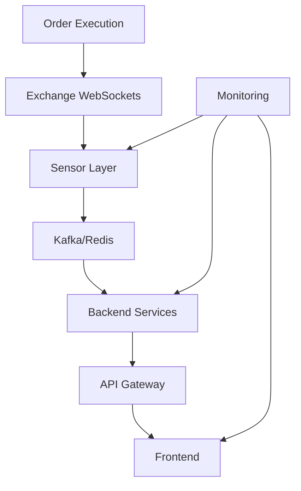

# SRD-004: Integration & Testing Strategy
**Status**: CRITICAL PATH  
**Priority**: P0  
**Timeline**: Hours 3-5  
**Version**: 1.0.0  
**Last Updated**: 2025-07-26

## Executive Summary

Integration testing validates the entire Jackbot system works cohesively after individual component fixes. This SRD defines comprehensive testing strategies, data flow validation, and performance benchmarks to achieve the zero-error goal within 12 hours.

## Technical Context

### System Architecture


### Critical Data Flows
1. **Market Data Pipeline**: Exchange → Sensor → Kafka → Backend → Frontend
2. **Order Execution**: Frontend → API → Execution → Exchange → Confirmation
3. **Risk Management**: All components → Risk Engine → Circuit Breakers

## Integration Test Suites

### Suite 1: End-to-End Market Data Flow

**Test File**: `/tests/integration/market_data_e2e.rs`

```rust
use tokio::test;
use jackbot_sensor::connector::Connector;
use jackbot_data::streams::builder::ExchangeWsStreamBuilder;
use rdkafka::consumer::{StreamConsumer, Consumer};
use rdkafka::config::ClientConfig;

#[tokio::test]
async fn test_market_data_flow_binance() {
    // 1. Start sensor with test configuration
    let sensor_config = SensorConfig {
        exchanges: vec![ExchangeConfig {
            name: "binance",
            symbols: vec!["BTCUSDT", "ETHUSDT"],
            channels: vec!["orderbook", "trades"],
        }],
        kafka: KafkaConfig {
            brokers: "localhost:9092",
            topic_prefix: "test_market_data",
        },
    };
    
    let sensor = Sensor::new(sensor_config);
    let sensor_handle = tokio::spawn(async move {
        sensor.run().await
    });
    
    // 2. Create Kafka consumer
    let consumer: StreamConsumer = ClientConfig::new()
        .set("bootstrap.servers", "localhost:9092")
        .set("group.id", "test_consumer")
        .set("auto.offset.reset", "earliest")
        .create()
        .expect("Consumer creation failed");
    
    consumer.subscribe(&["test_market_data.orderbook.binance"])
        .expect("Subscription failed");
    
    // 3. Validate data flow
    let mut message_count = 0;
    let timeout = Duration::from_secs(30);
    let start = Instant::now();
    
    while start.elapsed() < timeout && message_count < 10 {
        match consumer.recv().await {
            Ok(message) => {
                let payload = message.payload().expect("Message payload missing");
                let order_book: OrderBookData = serde_json::from_slice(payload)
                    .expect("Deserialization failed");
                
                // Validate structure
                assert!(!order_book.bids.is_empty());
                assert!(!order_book.asks.is_empty());
                assert!(order_book.timestamp > 0);
                assert_eq!(order_book.exchange, "binance");
                
                message_count += 1;
            }
            Err(e) => panic!("Kafka error: {:?}", e),
        }
    }
    
    assert!(message_count >= 10, "Insufficient messages received");
    
    // Cleanup
    sensor_handle.abort();
}

#[tokio::test] 
async fn test_latency_requirements() {
    let latency_monitor = LatencyMonitor::new();
    
    // Measure end-to-end latency
    let exchange_timestamp = get_exchange_timestamp();
    let sensor_timestamp = get_sensor_processing_timestamp();
    let kafka_timestamp = get_kafka_delivery_timestamp();
    let backend_timestamp = get_backend_processing_timestamp();
    
    let total_latency = backend_timestamp - exchange_timestamp;
    let sensor_latency = sensor_timestamp - exchange_timestamp;
    let kafka_latency = kafka_timestamp - sensor_timestamp;
    let backend_latency = backend_timestamp - kafka_timestamp;
    
    // Assert latency requirements
    assert!(total_latency < Duration::from_millis(100), 
        "Total latency {} exceeds 100ms requirement", total_latency.as_millis());
    assert!(sensor_latency < Duration::from_millis(10),
        "Sensor latency {} exceeds 10ms requirement", sensor_latency.as_millis());
    assert!(kafka_latency < Duration::from_millis(20),
        "Kafka latency {} exceeds 20ms requirement", kafka_latency.as_millis());
}
```

### Suite 2: Order Execution Integration

**Test File**: `/tests/integration/order_execution_e2e.rs`

```rust
#[tokio::test]
async fn test_order_execution_flow() {
    // 1. Setup mock exchange
    let mock_exchange = MockExchange::new()
        .with_balance("USDT", 10000.0)
        .with_orderbook("BTCUSDT", vec![(50000.0, 1.0)], vec![(50010.0, 1.0)]);
    
    // 2. Create order request
    let order_request = OrderRequest {
        symbol: "BTCUSDT".to_string(),
        exchange: "binance".to_string(),
        side: OrderSide::Buy,
        order_type: OrderType::Limit,
        quantity: 0.1,
        price: Some(50000.0),
        client_order_id: Uuid::new_v4().to_string(),
    };
    
    // 3. Execute through system
    let execution_engine = ExecutionEngine::new()
        .with_exchange("binance", mock_exchange);
    
    let result = execution_engine.execute_order(order_request).await;
    
    // 4. Validate execution
    assert!(result.is_ok());
    let order = result.unwrap();
    assert_eq!(order.status, OrderStatus::Filled);
    assert_eq!(order.filled_quantity, 0.1);
    assert_eq!(order.average_price, 50000.0);
    
    // 5. Verify state updates
    let position = execution_engine.get_position("BTCUSDT").await;
    assert_eq!(position.quantity, 0.1);
    assert_eq!(position.entry_price, 50000.0);
}

#[tokio::test]
async fn test_risk_management_integration() {
    let risk_engine = RiskEngine::new()
        .with_max_position_size(1.0)
        .with_max_daily_loss(1000.0)
        .with_circuit_breaker(5, Duration::from_secs(60));
    
    let execution_engine = ExecutionEngine::new()
        .with_risk_engine(risk_engine);
    
    // Test position limit
    let large_order = OrderRequest {
        symbol: "BTCUSDT".to_string(),
        exchange: "binance".to_string(),
        side: OrderSide::Buy,
        quantity: 2.0, // Exceeds limit
        order_type: OrderType::Market,
        ..Default::default()
    };
    
    let result = execution_engine.execute_order(large_order).await;
    assert!(result.is_err());
    assert_eq!(result.unwrap_err(), ExecutionError::RiskLimitExceeded);
    
    // Test circuit breaker
    for i in 0..6 {
        let order = create_test_order();
        let _ = execution_engine.execute_order(order).await;
    }
    
    let final_order = create_test_order();
    let result = execution_engine.execute_order(final_order).await;
    assert!(result.is_err());
    assert_eq!(result.unwrap_err(), ExecutionError::CircuitBreakerTriggered);
}
```

### Suite 3: WebSocket Resilience Testing

**Test File**: `/tests/integration/websocket_resilience.rs`

```rust
#[tokio::test]
async fn test_websocket_reconnection() {
    let mut mock_server = MockWebSocketServer::new("127.0.0.1:8080");
    
    // Start sensor
    let sensor = Sensor::new(test_config());
    let sensor_handle = tokio::spawn(async move {
        sensor.run().await
    });
    
    // Wait for initial connection
    tokio::time::sleep(Duration::from_secs(2)).await;
    assert_eq!(mock_server.connection_count(), 1);
    
    // Simulate disconnection
    mock_server.disconnect_all();
    tokio::time::sleep(Duration::from_millis(100)).await;
    
    // Verify reconnection
    tokio::time::sleep(Duration::from_secs(2)).await;
    assert_eq!(mock_server.connection_count(), 2);
    
    // Verify data flow continues
    mock_server.send_message(create_test_orderbook());
    let received = wait_for_kafka_message("test_orderbook", Duration::from_secs(5)).await;
    assert!(received.is_some());
}

#[tokio::test]
async fn test_websocket_rate_limiting() {
    let rate_limiter = RateLimiter::new()
        .with_limit(100, Duration::from_secs(1));
    
    let connector = BinanceConnector::new()
        .with_rate_limiter(rate_limiter);
    
    // Send burst of requests
    let mut handles = vec![];
    for _ in 0..150 {
        let conn = connector.clone();
        handles.push(tokio::spawn(async move {
            conn.subscribe("BTCUSDT", vec!["trades"]).await
        }));
    }
    
    let results: Vec<_> = futures::future::join_all(handles).await;
    
    // Verify rate limiting
    let successful = results.iter().filter(|r| r.is_ok()).count();
    assert_eq!(successful, 100); // Only 100 should succeed
    
    let rate_limited = results.iter()
        .filter(|r| matches!(r, Err(e) if e.is_rate_limited()))
        .count();
    assert_eq!(rate_limited, 50);
}
```

### Suite 4: Performance Benchmarks

**Test File**: `/tests/integration/performance_benchmarks.rs`

```rust
use criterion::{black_box, criterion_group, criterion_main, Criterion};

fn benchmark_order_book_processing(c: &mut Criterion) {
    let runtime = tokio::runtime::Runtime::new().unwrap();
    
    c.bench_function("orderbook_update_processing", |b| {
        b.iter(|| {
            runtime.block_on(async {
                let orderbook = create_large_orderbook(1000); // 1000 levels
                let processor = OrderBookProcessor::new();
                processor.process(black_box(orderbook)).await
            })
        })
    });
}

fn benchmark_trade_aggregation(c: &mut Criterion) {
    c.bench_function("trade_aggregation_1000", |b| {
        let trades = create_test_trades(1000);
        let aggregator = TradeAggregator::new();
        
        b.iter(|| {
            aggregator.aggregate(black_box(&trades))
        })
    });
}

fn benchmark_risk_calculations(c: &mut Criterion) {
    c.bench_function("portfolio_risk_calculation", |b| {
        let positions = create_test_positions(50); // 50 positions
        let risk_engine = RiskEngine::new();
        
        b.iter(|| {
            risk_engine.calculate_portfolio_risk(black_box(&positions))
        })
    });
}

criterion_group!(benches, 
    benchmark_order_book_processing,
    benchmark_trade_aggregation,
    benchmark_risk_calculations
);
criterion_main!(benches);
```

## System Integration Tests

### Docker Compose Test Environment

**File**: `/tests/docker-compose.test.yml`

```yaml
version: '3.8'

services:
  zookeeper:
    image: confluentinc/cp-zookeeper:7.4.0
    environment:
      ZOOKEEPER_CLIENT_PORT: 2181
      ZOOKEEPER_TICK_TIME: 2000

  kafka:
    image: confluentinc/cp-kafka:7.4.0
    depends_on:
      - zookeeper
    ports:
      - "9092:9092"
    environment:
      KAFKA_BROKER_ID: 1
      KAFKA_ZOOKEEPER_CONNECT: zookeeper:2181
      KAFKA_ADVERTISED_LISTENERS: PLAINTEXT://localhost:9092
      KAFKA_OFFSETS_TOPIC_REPLICATION_FACTOR: 1

  redis:
    image: redis:7-alpine
    ports:
      - "6379:6379"

  postgres:
    image: postgres:15-alpine
    environment:
      POSTGRES_DB: jackbot_test
      POSTGRES_USER: jackbot
      POSTGRES_PASSWORD: testpass
    ports:
      - "5432:5432"

  sensor:
    build:
      context: .
      dockerfile: Dockerfile
    depends_on:
      - kafka
      - redis
    environment:
      KAFKA_BROKERS: kafka:9092
      REDIS_URL: redis://redis:6379
      RUST_LOG: debug
    volumes:
      - ./config/test.toml:/app/config.toml

  mock-exchange:
    build:
      context: ./tests/mock-exchange
      dockerfile: Dockerfile
    ports:
      - "8080:8080"
    environment:
      LATENCY_MS: 5
      ERROR_RATE: 0.001
```

### Test Execution Script

**File**: `/tests/run_integration_tests.sh`

```bash
#!/bin/bash
set -e

echo "Starting integration test environment..."

# Start services
docker-compose -f tests/docker-compose.test.yml up -d

# Wait for services
echo "Waiting for services to be ready..."
./scripts/wait-for-it.sh localhost:9092 -t 60
./scripts/wait-for-it.sh localhost:6379 -t 30
./scripts/wait-for-it.sh localhost:5432 -t 30

# Run migrations
echo "Running database migrations..."
cargo sqlx migrate run

# Run integration tests
echo "Running integration tests..."
RUST_LOG=info cargo test --test '*integration*' -- --test-threads=1

# Run performance tests
echo "Running performance benchmarks..."
cargo bench --bench performance_benchmarks

# Collect results
echo "Collecting test results..."
mkdir -p test-results
cp target/criterion/* test-results/

# Cleanup
echo "Cleaning up..."
docker-compose -f tests/docker-compose.test.yml down

echo "Integration tests complete!"
```

## Monitoring & Observability

### Metrics Collection

```rust
// src/metrics.rs
use prometheus::{Counter, Histogram, Registry};

pub struct Metrics {
    pub messages_processed: Counter,
    pub processing_latency: Histogram,
    pub errors: Counter,
    pub websocket_reconnections: Counter,
}

impl Metrics {
    pub fn new(registry: &Registry) -> Self {
        Self {
            messages_processed: Counter::new("jackbot_messages_processed_total", "Total messages processed")
                .expect("metric creation failed"),
            processing_latency: Histogram::new("jackbot_processing_latency_seconds", "Message processing latency")
                .expect("metric creation failed"),
            errors: Counter::new("jackbot_errors_total", "Total errors")
                .expect("metric creation failed"),
            websocket_reconnections: Counter::new("jackbot_ws_reconnections_total", "WebSocket reconnections")
                .expect("metric creation failed"),
        }
    }
}
```

### Health Checks

```rust
// src/health.rs
#[derive(Serialize)]
pub struct HealthStatus {
    pub status: String,
    pub components: HashMap<String, ComponentHealth>,
    pub timestamp: i64,
}

#[derive(Serialize)]
pub struct ComponentHealth {
    pub status: String,
    pub latency_ms: Option<f64>,
    pub error_rate: Option<f64>,
    pub details: Option<String>,
}

pub async fn health_check() -> HealthStatus {
    let mut components = HashMap::new();
    
    // Check Kafka
    components.insert("kafka".to_string(), check_kafka_health().await);
    
    // Check Redis
    components.insert("redis".to_string(), check_redis_health().await);
    
    // Check WebSocket connections
    components.insert("websockets".to_string(), check_websocket_health().await);
    
    let overall_status = if components.values().all(|c| c.status == "healthy") {
        "healthy"
    } else {
        "degraded"
    };
    
    HealthStatus {
        status: overall_status.to_string(),
        components,
        timestamp: Utc::now().timestamp(),
    }
}
```

## Success Criteria

### Performance Requirements
- **Latency**: 95th percentile < 50ms, 99th percentile < 100ms
- **Throughput**: > 10,000 messages/second per exchange
- **Memory**: < 2GB for sensor, < 4GB for backend
- **CPU**: < 50% utilization under normal load

### Reliability Requirements
- **Uptime**: 99.9% excluding planned maintenance
- **Recovery Time**: < 5 seconds for WebSocket reconnection
- **Data Loss**: 0% for critical market data
- **Error Rate**: < 0.01% for message processing

### Test Coverage
- **Unit Tests**: > 80% code coverage
- **Integration Tests**: All critical paths covered
- **Performance Tests**: Baseline established for all components
- **Chaos Tests**: System recovers from all failure scenarios

## Implementation Timeline

### Hour 3-4: Foundation Setup
- [ ] Set up Docker test environment (30 min)
- [ ] Configure test databases and queues (30 min)
- [ ] Create mock exchange server (30 min)
- [ ] Write helper utilities (30 min)

### Hour 4-5: Test Implementation
- [ ] Implement market data flow tests (30 min)
- [ ] Implement order execution tests (30 min)
- [ ] Implement resilience tests (30 min)
- [ ] Run full test suite (30 min)

## Risk Mitigation

1. **Test Environment Issues**
   - Maintain local fallback environment
   - Use testcontainers for isolation
   - Version lock all dependencies

2. **Flaky Tests**
   - Add retry logic for network operations
   - Use deterministic time in tests
   - Isolate test data per run

3. **Performance Regression**
   - Establish baseline metrics
   - Run benchmarks on every commit
   - Alert on > 10% degradation