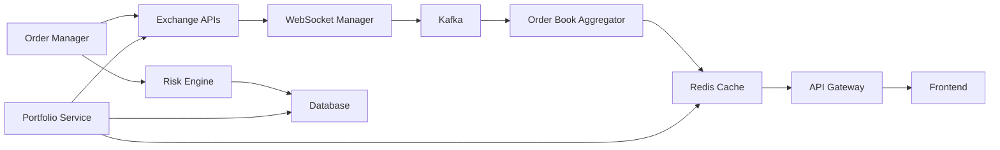

# Integration Testing Priorities

**Version:** 1.0.0  
**Date:** 2025-07-26  
**Focus:** Multi-Component Integration  
**Target:** End-to-End MVP Validation

## Executive Summary

This specification prioritizes integration testing for Jackbot's distributed architecture, focusing on critical data flows between exchanges, backend services, and frontend components. We emphasize testing the three MVP features across all system boundaries.

## Integration Test Architecture



## 1. Critical Integration Points

### 1.1 Exchange → Backend Integration

```rust
#[cfg(test)]
mod exchange_integration {
    use super::*;
    
    #[tokio::test]
    #[timeout(30000)] // 30 second timeout
    async fn test_multi_exchange_connectivity() {
        let exchanges = vec![
            ("binance", "wss://stream.binance.com:9443/ws"),
            ("coinbase", "wss://ws-feed.exchange.coinbase.com"),
            ("kraken", "wss://ws.kraken.com"),
        ];
        
        let connection_manager = ConnectionManager::new();
        
        // Connect to all exchanges
        for (name, url) in &exchanges {
            let result = connection_manager.connect(name, url).await;
            assert!(result.is_ok(), "Failed to connect to {}", name);
        }
        
        // Verify all connections are healthy
        tokio::time::sleep(Duration::seconds(2)).await;
        
        for (name, _) in &exchanges {
            let health = connection_manager.check_health(name).await;
            assert!(health.is_connected);
            assert!(health.latency_ms < 1000);
        }
    }
    
    #[tokio::test]
    async fn test_orderbook_data_flow() {
        // Initialize components
        let ws_manager = WebSocketManager::new();
        let kafka_producer = KafkaProducer::new("localhost:9092");
        let aggregator = OrderBookAggregator::new();
        
        // Connect to exchange
        ws_manager.connect("binance", "btcusdt@depth20@100ms").await?;
        
        // Set up data pipeline
        let mut data_stream = ws_manager.subscribe_orderbook("binance", "BTC-USDT");
        
        // Process 10 orderbook updates
        for _ in 0..10 {
            let update = timeout(Duration::seconds(5), data_stream.next()).await??;
            
            // Send to Kafka
            let kafka_result = kafka_producer.send("orderbooks", &update).await;
            assert!(kafka_result.is_ok());
            
            // Update aggregator
            aggregator.update(update.clone()).await;
        }
        
        // Verify aggregated orderbook
        let aggregated = aggregator.get_orderbook("BTC-USDT").await;
        assert!(!aggregated.bids.is_empty());
        assert!(!aggregated.asks.is_empty());
        assert!(aggregated.spread() > 0.0);
    }
}
```

### 1.2 Backend Services Integration

```rust
#[tokio::test]
async fn test_service_orchestration() {
    // Start test environment
    let test_env = TestEnvironment::new().await;
    
    // Initialize services
    let order_service = OrderService::new(&test_env.config);
    let portfolio_service = PortfolioService::new(&test_env.config);
    let risk_service = RiskService::new(&test_env.config);
    
    // Test order flow through services
    let order_request = OrderRequest {
        symbol: "BTC-USD".to_string(),
        side: OrderSide::Buy,
        quantity: 0.1,
        order_type: OrderType::Market,
        exchange: "binance".to_string(),
    };
    
    // Step 1: Risk check
    let risk_result = risk_service.evaluate_order(&order_request).await?;
    assert!(risk_result.approved);
    
    // Step 2: Submit order
    let order_id = order_service.submit_order(order_request.clone()).await?;
    assert!(!order_id.is_empty());
    
    // Step 3: Wait for execution
    let execution = order_service.wait_for_execution(&order_id, Duration::seconds(10)).await?;
    assert_eq!(execution.status, OrderStatus::Filled);
    
    // Step 4: Verify portfolio update
    tokio::time::sleep(Duration::seconds(1)).await; // Allow propagation
    
    let portfolio = portfolio_service.get_portfolio().await?;
    let btc_position = portfolio.get_position("BTC-USD");
    assert!(btc_position.is_some());
    assert_eq!(btc_position.unwrap().quantity, 0.1);
}
```

### 1.3 Database Integration

```rust
#[cfg(test)]
mod database_integration {
    use super::*;
    
    #[tokio::test]
    async fn test_transaction_consistency() {
        let db = Database::new_test().await;
        
        // Start transaction
        let mut tx = db.begin().await?;
        
        // Insert order
        let order = Order {
            id: Uuid::new_v4(),
            user_id: "test_user",
            symbol: "BTC-USD",
            side: OrderSide::Buy,
            quantity: 0.5,
            price: Some(50000.0),
            status: OrderStatus::Pending,
            created_at: Utc::now(),
        };
        
        tx.insert_order(&order).await?;
        
        // Insert trade
        let trade = Trade {
            id: Uuid::new_v4(),
            order_id: order.id,
            price: 50000.0,
            quantity: 0.5,
            fee: 25.0,
            executed_at: Utc::now(),
        };
        
        tx.insert_trade(&trade).await?;
        
        // Update balance
        tx.update_balance("test_user", "USD", -25025.0).await?;
        tx.update_balance("test_user", "BTC", 0.5).await?;
        
        // Commit transaction
        tx.commit().await?;
        
        // Verify consistency
        let saved_order = db.get_order(order.id).await?;
        assert_eq!(saved_order.status, OrderStatus::Pending);
        
        let balance = db.get_balance("test_user", "BTC").await?;
        assert_eq!(balance, 0.5);
    }
    
    #[tokio::test]
    async fn test_concurrent_updates() {
        let db = Database::new_test().await;
        let user_id = "concurrent_user";
        
        // Set initial balance
        db.set_balance(user_id, "USD", 10000.0).await?;
        
        // Spawn 10 concurrent updates
        let mut handles = vec![];
        
        for i in 0..10 {
            let db_clone = db.clone();
            let user_id = user_id.to_string();
            
            let handle = tokio::spawn(async move {
                db_clone.update_balance(&user_id, "USD", 100.0).await
            });
            
            handles.push(handle);
        }
        
        // Wait for all updates
        for handle in handles {
            handle.await??;
        }
        
        // Verify final balance
        let final_balance = db.get_balance(user_id, "USD").await?;
        assert_eq!(final_balance, 11000.0); // 10000 + (10 * 100)
    }
}
```

## 2. End-to-End Test Scenarios

### 2.1 Market Data Display E2E

```rust
#[tokio::test]
#[ignore] // Run only in E2E suite
async fn test_market_data_e2e() {
    let test_env = E2ETestEnvironment::start().await;
    
    // Wait for services to be ready
    test_env.wait_for_healthy().await;
    
    // Subscribe to market data via WebSocket
    let ws_client = WebSocketClient::connect(&test_env.ws_url).await?;
    ws_client.subscribe(vec!["ticker:BTC-USD", "orderbook:BTC-USD"]).await?;
    
    // Inject test market data
    test_env.inject_market_data(MarketData {
        symbol: "BTC-USD",
        bid: 49900.0,
        ask: 50100.0,
        last: 50000.0,
        volume: 1234.56,
    }).await;
    
    // Verify data received via WebSocket
    let message = timeout(Duration::seconds(5), ws_client.next_message()).await??;
    
    match message {
        WSMessage::Ticker(ticker) => {
            assert_eq!(ticker.symbol, "BTC-USD");
            assert_eq!(ticker.last, 50000.0);
        }
        _ => panic!("Expected ticker message"),
    }
    
    // Verify data available via REST API
    let api_client = ApiClient::new(&test_env.api_url);
    let ticker = api_client.get_ticker("BTC-USD").await?;
    
    assert_eq!(ticker.symbol, "BTC-USD");
    assert_eq!(ticker.bid, 49900.0);
    assert_eq!(ticker.ask, 50100.0);
}
```

### 2.2 Portfolio View E2E

```rust
#[tokio::test]
#[ignore]
async fn test_portfolio_e2e() {
    let test_env = E2ETestEnvironment::start().await;
    let api_client = ApiClient::new(&test_env.api_url);
    
    // Authenticate
    let auth_token = api_client.login("test_user", "test_pass").await?;
    api_client.set_auth_token(&auth_token);
    
    // Get initial portfolio
    let initial_portfolio = api_client.get_portfolio().await?;
    assert_eq!(initial_portfolio.total_value_usd, 10000.0); // Test account balance
    
    // Simulate trade execution
    test_env.simulate_trade(SimulatedTrade {
        user_id: "test_user",
        symbol: "BTC-USD",
        side: TradeSide::Buy,
        quantity: 0.2,
        price: 50000.0,
    }).await;
    
    // Wait for portfolio update
    tokio::time::sleep(Duration::seconds(2)).await;
    
    // Get updated portfolio
    let updated_portfolio = api_client.get_portfolio().await?;
    
    // Verify position added
    let btc_position = updated_portfolio.positions.iter()
        .find(|p| p.symbol == "BTC-USD")
        .expect("BTC position not found");
    
    assert_eq!(btc_position.quantity, 0.2);
    assert_eq!(btc_position.average_price, 50000.0);
    
    // Verify WebSocket updates
    let ws_client = WebSocketClient::connect(&test_env.ws_url).await?;
    ws_client.authenticate(&auth_token).await?;
    ws_client.subscribe(vec!["portfolio:updates"]).await?;
    
    // Trigger price update
    test_env.update_price("BTC-USD", 52000.0).await;
    
    // Verify portfolio update notification
    let update = timeout(Duration::seconds(5), ws_client.next_message()).await??;
    
    match update {
        WSMessage::PortfolioUpdate(update) => {
            assert!(update.total_value_usd > 10000.0); // Profit from price increase
            assert_eq!(update.pnl.unrealized, 400.0); // 0.2 * (52000 - 50000)
        }
        _ => panic!("Expected portfolio update"),
    }
}
```

### 2.3 Order Placement E2E

```rust
#[tokio::test]
#[ignore]
async fn test_order_placement_e2e() {
    let test_env = E2ETestEnvironment::start().await;
    let api_client = ApiClient::new(&test_env.api_url);
    
    // Authenticate
    let auth_token = api_client.login("test_user", "test_pass").await?;
    api_client.set_auth_token(&auth_token);
    
    // Place market order
    let order_request = OrderRequest {
        symbol: "BTC-USD",
        side: OrderSide::Buy,
        quantity: 0.1,
        order_type: OrderType::Market,
        exchange: "binance",
    };
    
    let order_response = api_client.place_order(order_request).await?;
    assert!(!order_response.order_id.is_empty());
    
    // Monitor order status via WebSocket
    let ws_client = WebSocketClient::connect(&test_env.ws_url).await?;
    ws_client.authenticate(&auth_token).await?;
    ws_client.subscribe(vec!["orders:updates"]).await?;
    
    // Wait for order updates
    let mut filled = false;
    let timeout_duration = Duration::seconds(10);
    let start = Instant::now();
    
    while !filled && start.elapsed() < timeout_duration {
        if let Ok(Ok(message)) = timeout(Duration::seconds(1), ws_client.next_message()).await {
            match message {
                WSMessage::OrderUpdate(update) => {
                    if update.order_id == order_response.order_id {
                        match update.status {
                            OrderStatus::Filled => {
                                filled = true;
                                assert_eq!(update.filled_quantity, 0.1);
                            }
                            OrderStatus::Rejected => {
                                panic!("Order rejected: {:?}", update.reject_reason);
                            }
                            _ => {} // Continue waiting
                        }
                    }
                }
                _ => {}
            }
        }
    }
    
    assert!(filled, "Order was not filled within timeout");
    
    // Verify order in history
    let order_history = api_client.get_order_history().await?;
    let executed_order = order_history.iter()
        .find(|o| o.id == order_response.order_id)
        .expect("Order not found in history");
    
    assert_eq!(executed_order.status, OrderStatus::Filled);
    assert_eq!(executed_order.filled_quantity, 0.1);
}
```

## 3. Infrastructure Integration

### 3.1 Docker Compose Test Environment

```yaml
# docker-compose.test.yml
version: '3.8'

services:
  postgres:
    image: postgres:15
    environment:
      POSTGRES_DB: jackbot_test
      POSTGRES_USER: test
      POSTGRES_PASSWORD: test
    ports:
      - "5432:5432"
    healthcheck:
      test: ["CMD-SHELL", "pg_isready -U test"]
      interval: 5s
      timeout: 5s
      retries: 5

  redis:
    image: redis:7-alpine
    ports:
      - "6379:6379"
    healthcheck:
      test: ["CMD", "redis-cli", "ping"]
      interval: 5s
      timeout: 5s
      retries: 5

  kafka:
    image: confluentinc/cp-kafka:7.5.0
    depends_on:
      - zookeeper
    ports:
      - "9092:9092"
    environment:
      KAFKA_BROKER_ID: 1
      KAFKA_ZOOKEEPER_CONNECT: zookeeper:2181
      KAFKA_ADVERTISED_LISTENERS: PLAINTEXT://localhost:9092
      KAFKA_OFFSETS_TOPIC_REPLICATION_FACTOR: 1

  zookeeper:
    image: confluentinc/cp-zookeeper:7.5.0
    ports:
      - "2181:2181"
    environment:
      ZOOKEEPER_CLIENT_PORT: 2181
      ZOOKEEPER_TICK_TIME: 2000

  mock-exchange:
    build:
      context: ./tests/mock-exchange
      dockerfile: Dockerfile
    ports:
      - "8080:8080"
    environment:
      EXCHANGE_NAME: mock
      LATENCY_MS: 50
      FAILURE_RATE: 0.001
```

### 3.2 Test Data Setup

```rust
// tests/integration/setup.rs
pub async fn setup_test_environment() -> Result<TestEnvironment> {
    // Start Docker containers
    let docker = Docker::connect_with_local_defaults()?;
    let compose = DockerCompose::new("docker-compose.test.yml");
    compose.up().await?;
    
    // Wait for services
    wait_for_postgres(&docker).await?;
    wait_for_redis(&docker).await?;
    wait_for_kafka(&docker).await?;
    
    // Run migrations
    run_migrations().await?;
    
    // Seed test data
    seed_test_data().await?;
    
    // Initialize services
    let config = TestConfig::from_env();
    let services = Services::init(&config).await?;
    
    Ok(TestEnvironment {
        docker,
        compose,
        config,
        services,
    })
}

async fn seed_test_data() -> Result<()> {
    let db = Database::connect(&env::var("TEST_DATABASE_URL")?).await?;
    
    // Create test users
    for i in 0..5 {
        db.create_user(&User {
            id: format!("test_user_{}", i),
            email: format!("user{}@test.com", i),
            api_key: generate_test_api_key(),
            created_at: Utc::now(),
        }).await?;
        
        // Add initial balance
        db.set_balance(&format!("test_user_{}", i), "USD", 10000.0).await?;
    }
    
    // Add test instruments
    let instruments = vec![
        ("BTC-USD", "Bitcoin"),
        ("ETH-USD", "Ethereum"),
        ("SOL-USD", "Solana"),
    ];
    
    for (symbol, name) in instruments {
        db.create_instrument(&Instrument {
            symbol: symbol.to_string(),
            name: name.to_string(),
            base_currency: symbol.split('-').next().unwrap().to_string(),
            quote_currency: "USD".to_string(),
            min_quantity: 0.001,
            max_quantity: 1000.0,
            tick_size: 0.01,
        }).await?;
    }
    
    Ok(())
}
```

## 4. Performance Integration Tests

### 4.1 Latency Testing

```rust
#[cfg(test)]
mod performance_integration {
    use super::*;
    
    #[tokio::test]
    async fn test_order_execution_latency() {
        let test_env = TestEnvironment::new().await;
        let order_service = &test_env.services.order_service;
        
        let mut latencies = Vec::new();
        
        // Execute 100 orders and measure latency
        for _ in 0..100 {
            let start = Instant::now();
            
            let order = OrderRequest {
                symbol: "BTC-USD",
                side: OrderSide::Buy,
                quantity: 0.01,
                order_type: OrderType::Market,
                exchange: "mock",
            };
            
            let result = order_service.execute_order(order).await?;
            let latency = start.elapsed();
            
            latencies.push(latency.as_millis());
            
            // Small delay between orders
            tokio::time::sleep(Duration::milliseconds(100)).await;
        }
        
        // Calculate statistics
        latencies.sort();
        let p50 = latencies[50];
        let p95 = latencies[95];
        let p99 = latencies[99];
        
        println!("Order Execution Latency:");
        println!("  P50: {}ms", p50);
        println!("  P95: {}ms", p95);
        println!("  P99: {}ms", p99);
        
        // Assert performance requirements
        assert!(p50 < 100, "P50 latency exceeds 100ms");
        assert!(p99 < 200, "P99 latency exceeds 200ms");
    }
    
    #[tokio::test]
    async fn test_market_data_throughput() {
        let test_env = TestEnvironment::new().await;
        let market_data = &test_env.services.market_data;
        
        // Subscribe to all test symbols
        let symbols = vec!["BTC-USD", "ETH-USD", "SOL-USD"];
        for symbol in &symbols {
            market_data.subscribe(symbol).await?;
        }
        
        // Measure throughput over 10 seconds
        let start = Instant::now();
        let mut message_count = 0;
        
        while start.elapsed() < Duration::seconds(10) {
            if let Ok(Some(_)) = timeout(
                Duration::milliseconds(100),
                market_data.next_update()
            ).await {
                message_count += 1;
            }
        }
        
        let throughput = message_count as f64 / 10.0;
        println!("Market Data Throughput: {} messages/sec", throughput);
        
        // Assert minimum throughput
        assert!(throughput > 100.0, "Throughput below 100 msg/sec");
    }
}
```

### 4.2 Stress Testing

```rust
#[tokio::test]
#[ignore] // Run only in stress test suite
async fn test_concurrent_order_stress() {
    let test_env = TestEnvironment::new().await;
    let order_service = Arc::new(test_env.services.order_service);
    
    // Spawn 50 concurrent users
    let mut handles = vec![];
    
    for user_id in 0..50 {
        let order_service = order_service.clone();
        
        let handle = tokio::spawn(async move {
            // Each user places 20 orders
            for i in 0..20 {
                let order = OrderRequest {
                    symbol: "BTC-USD",
                    side: if i % 2 == 0 { OrderSide::Buy } else { OrderSide::Sell },
                    quantity: 0.01,
                    order_type: OrderType::Market,
                    exchange: "mock",
                };
                
                let result = order_service.execute_order_for_user(
                    &format!("test_user_{}", user_id),
                    order
                ).await;
                
                if let Err(e) = result {
                    eprintln!("Order failed for user {}: {:?}", user_id, e);
                }
                
                // Random delay between orders
                let delay = rand::thread_rng().gen_range(10..100);
                tokio::time::sleep(Duration::milliseconds(delay)).await;
            }
        });
        
        handles.push(handle);
    }
    
    // Wait for all users to complete
    let results = futures::future::join_all(handles).await;
    
    // Check for panics
    for result in results {
        assert!(result.is_ok(), "Task panicked");
    }
    
    // Verify system health
    let health = test_env.services.health_check().await?;
    assert!(health.all_services_healthy());
}
```

## 5. Integration Test Utilities

### 5.1 Test Helpers

```rust
// tests/integration/helpers.rs

pub struct MockExchangeClient {
    latency: Duration,
    failure_rate: f64,
    order_fill_rate: f64,
}

impl MockExchangeClient {
    pub async fn place_order(&self, order: &Order) -> Result<OrderResponse> {
        // Simulate network latency
        tokio::time::sleep(self.latency).await;
        
        // Simulate failures
        if rand::random::<f64>() < self.failure_rate {
            return Err(ExchangeError::NetworkError("Simulated failure".into()));
        }
        
        // Simulate order rejection
        if rand::random::<f64>() > self.order_fill_rate {
            return Ok(OrderResponse {
                order_id: Uuid::new_v4().to_string(),
                status: OrderStatus::Rejected,
                reject_reason: Some("Insufficient liquidity".to_string()),
            });
        }
        
        Ok(OrderResponse {
            order_id: Uuid::new_v4().to_string(),
            status: OrderStatus::Filled,
            reject_reason: None,
        })
    }
}

pub async fn wait_for_service(url: &str, timeout: Duration) -> Result<()> {
    let start = Instant::now();
    
    while start.elapsed() < timeout {
        if let Ok(response) = reqwest::get(format!("{}/health", url)).await {
            if response.status().is_success() {
                return Ok(());
            }
        }
        
        tokio::time::sleep(Duration::seconds(1)).await;
    }
    
    Err(anyhow!("Service did not become healthy within timeout"))
}
```

### 5.2 Test Fixtures

```rust
pub mod fixtures {
    use super::*;
    
    pub fn market_data_snapshot() -> MarketDataSnapshot {
        MarketDataSnapshot {
            symbol: "BTC-USD",
            timestamp: Utc::now(),
            bid: 49950.0,
            ask: 50050.0,
            last: 50000.0,
            volume_24h: 12345.67,
            orderbook: OrderBook {
                bids: vec![
                    Level { price: 49950.0, quantity: 1.5 },
                    Level { price: 49940.0, quantity: 2.0 },
                    Level { price: 49930.0, quantity: 2.5 },
                ],
                asks: vec![
                    Level { price: 50050.0, quantity: 1.5 },
                    Level { price: 50060.0, quantity: 2.0 },
                    Level { price: 50070.0, quantity: 2.5 },
                ],
            },
        }
    }
    
    pub fn create_test_portfolio() -> Portfolio {
        Portfolio {
            user_id: "test_user",
            positions: vec![
                Position {
                    symbol: "BTC-USD",
                    quantity: 0.5,
                    average_price: 45000.0,
                    exchange: "binance",
                },
                Position {
                    symbol: "ETH-USD",
                    quantity: 10.0,
                    average_price: 3000.0,
                    exchange: "coinbase",
                },
            ],
            cash_balance: hashmap! {
                "USD" => 20000.0,
                "USDT" => 5000.0,
            },
            updated_at: Utc::now(),
        }
    }
}
```

## 6. Integration Test Monitoring

### 6.1 Test Metrics Collection

```rust
#[derive(Metrics)]
struct IntegrationTestMetrics {
    #[metric(counter)]
    tests_executed: Counter,
    
    #[metric(histogram)]
    test_duration: Histogram,
    
    #[metric(gauge)]
    active_test_environments: Gauge,
    
    #[metric(counter)]
    infrastructure_failures: Counter,
}

impl IntegrationTestMetrics {
    pub fn record_test_execution(&self, test_name: &str, duration: Duration, success: bool) {
        self.tests_executed.inc();
        self.test_duration.observe(duration.as_secs_f64());
        
        if !success {
            self.infrastructure_failures.inc();
        }
    }
}
```

### 6.2 Test Report Generation

```rust
pub async fn generate_integration_test_report(results: Vec<TestResult>) -> String {
    let mut report = String::new();
    
    report.push_str("# Integration Test Report\n\n");
    report.push_str(&format!("Generated: {}\n\n", Utc::now()));
    
    // Summary statistics
    let total = results.len();
    let passed = results.iter().filter(|r| r.passed).count();
    let failed = total - passed;
    
    report.push_str("## Summary\n");
    report.push_str(&format!("- Total Tests: {}\n", total));
    report.push_str(&format!("- Passed: {} ({:.1}%)\n", passed, (passed as f64 / total as f64) * 100.0));
    report.push_str(&format!("- Failed: {} ({:.1}%)\n", failed, (failed as f64 / total as f64) * 100.0));
    
    // Failed tests details
    if failed > 0 {
        report.push_str("\n## Failed Tests\n");
        for result in results.iter().filter(|r| !r.passed) {
            report.push_str(&format!("\n### {}\n", result.test_name));
            report.push_str(&format!("- Duration: {:.2}s\n", result.duration.as_secs_f64()));
            report.push_str(&format!("- Error: {}\n", result.error.as_ref().unwrap()));
            if let Some(logs) = &result.logs {
                report.push_str("- Logs:\n```\n");
                report.push_str(logs);
                report.push_str("\n```\n");
            }
        }
    }
    
    // Performance metrics
    report.push_str("\n## Performance Metrics\n");
    let avg_duration = results.iter()
        .map(|r| r.duration.as_secs_f64())
        .sum::<f64>() / total as f64;
    
    report.push_str(&format!("- Average Test Duration: {:.2}s\n", avg_duration));
    
    report
}
```

## Next Steps

1. **Set Up Test Infrastructure** - Deploy Docker Compose environment
2. **Implement Mock Services** - Create mock exchange and market data services
3. **Write Integration Tests** - Start with critical path scenarios
4. **Configure CI Pipeline** - Automate integration test execution
5. **Monitor Test Results** - Track integration test metrics and trends