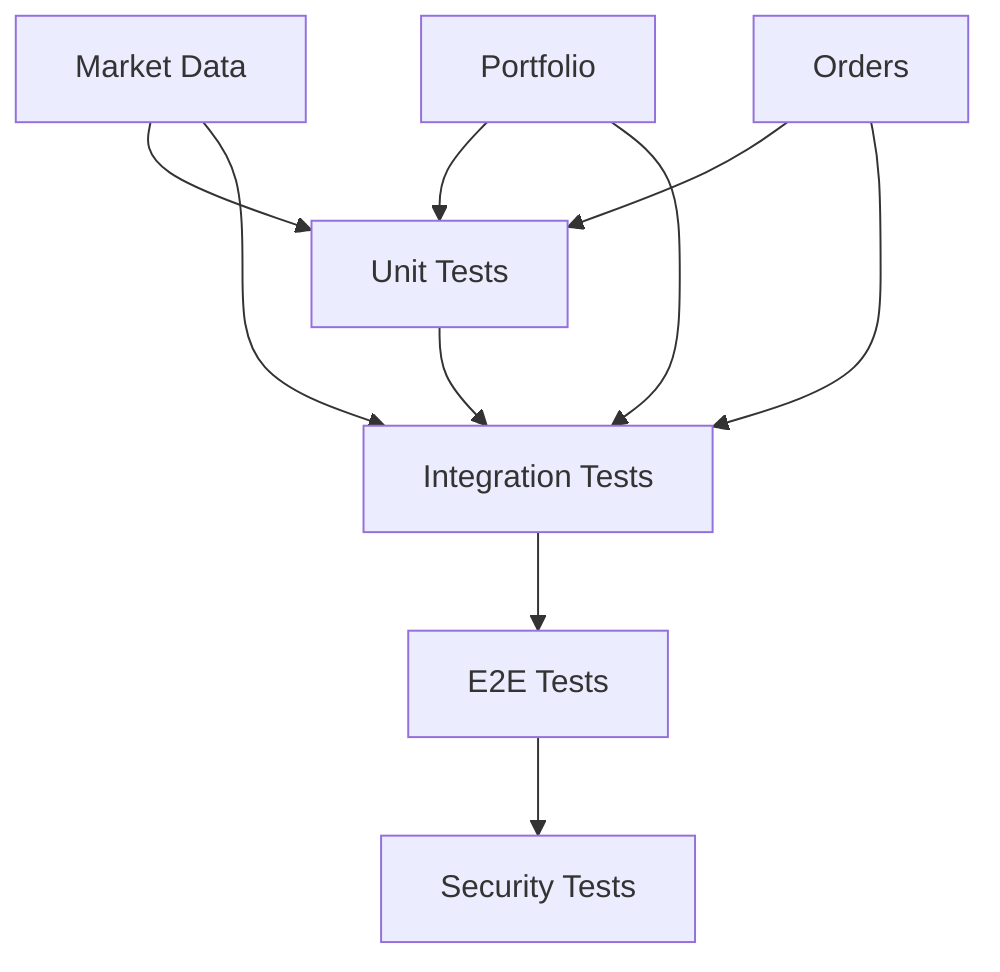

# Phase 4 Testing Specification

**Version:** 1.0.0  
**Date:** 2025-07-26  
**Target Coverage:** 15% on critical paths  
**Focus:** MVP Features (Market Data, Portfolio, Order Placement)

## Executive Summary

This specification defines the testing strategy for Phase 4 of Jackbot development, focusing on achieving 15% test coverage on MVP critical paths. We prioritize end-to-end validation of three core features: market data display, portfolio view, and order placement functionality.

## Testing Architecture

### Testing Layers



### Test Coverage Distribution

| Component | Target Coverage | Priority |
|-----------|----------------|----------|
| Market Data Pipeline | 20% | P0 |
| Portfolio Calculations | 25% | P0 |
| Order Execution | 30% | P0 |
| WebSocket Handlers | 15% | P1 |
| API Endpoints | 20% | P1 |
| Security Layer | 10% | P0 |

## 1. MVP Critical Path Testing

### 1.1 Market Data Display

#### Critical Paths
1. **WebSocket Connection → Data Processing → UI Update**
2. **Exchange Connection → Order Book Aggregation → Display**
3. **Price Feed → Real-time Updates → Chart Rendering**

#### Test Scenarios

##### Path 1: Real-time Price Updates
```rust
#[cfg(test)]
mod market_data_tests {
    use super::*;
    
    #[tokio::test]
    async fn test_websocket_price_update_flow() {
        // Given: WebSocket connection to exchange
        let mut ws_client = MockWebSocketClient::new();
        let price_processor = PriceProcessor::new();
        
        // When: Price update received
        let price_update = PriceUpdate {
            symbol: "BTC-USD".to_string(),
            price: 50000.0,
            timestamp: Utc::now(),
        };
        
        ws_client.emit_price_update(price_update.clone());
        
        // Then: Price is processed and available
        let processed = price_processor.get_latest("BTC-USD").await;
        assert_eq!(processed.unwrap().price, 50000.0);
    }
    
    #[tokio::test]
    async fn test_order_book_aggregation() {
        // Test order book updates from multiple exchanges
        let aggregator = OrderBookAggregator::new();
        
        // Simulate order books from 3 exchanges
        let binance_book = create_mock_order_book("binance", 49900.0, 50100.0);
        let coinbase_book = create_mock_order_book("coinbase", 49950.0, 50050.0);
        let kraken_book = create_mock_order_book("kraken", 49925.0, 50075.0);
        
        aggregator.update(binance_book).await;
        aggregator.update(coinbase_book).await;
        aggregator.update(kraken_book).await;
        
        let aggregated = aggregator.get_aggregated("BTC-USD").await;
        assert_eq!(aggregated.best_bid(), 49950.0); // Coinbase best bid
        assert_eq!(aggregated.best_ask(), 50050.0); // Coinbase best ask
    }
}
```

##### Path 2: Data Quality Validation
```rust
#[tokio::test]
async fn test_data_quality_checks() {
    let validator = MarketDataValidator::new();
    
    // Test stale data detection
    let stale_update = PriceUpdate {
        symbol: "BTC-USD".to_string(),
        price: 50000.0,
        timestamp: Utc::now() - Duration::minutes(5),
    };
    
    assert!(validator.is_stale(&stale_update));
    
    // Test price anomaly detection
    let anomaly_update = PriceUpdate {
        symbol: "BTC-USD".to_string(),
        price: 5000.0, // 90% drop
        timestamp: Utc::now(),
    };
    
    assert!(validator.is_anomaly(&anomaly_update, 50000.0));
}
```

### 1.2 Portfolio View

#### Critical Paths
1. **Balance Fetch → Position Calculation → P&L Display**
2. **Multi-Exchange Aggregation → Total Portfolio Value**
3. **Real-time Updates → Portfolio Recalculation**

#### Test Scenarios

##### Path 1: Portfolio Calculation
```rust
#[cfg(test)]
mod portfolio_tests {
    use super::*;
    
    #[tokio::test]
    async fn test_portfolio_value_calculation() {
        let portfolio = Portfolio::new();
        
        // Add positions
        portfolio.add_position(Position {
            symbol: "BTC-USD".to_string(),
            quantity: 0.5,
            average_price: 45000.0,
            exchange: "binance".to_string(),
        });
        
        portfolio.add_position(Position {
            symbol: "ETH-USD".to_string(),
            quantity: 10.0,
            average_price: 3000.0,
            exchange: "coinbase".to_string(),
        });
        
        // Update market prices
        portfolio.update_market_price("BTC-USD", 50000.0);
        portfolio.update_market_price("ETH-USD", 3500.0);
        
        // Calculate total value
        let total_value = portfolio.calculate_total_value();
        assert_eq!(total_value, 60000.0); // 0.5 * 50000 + 10 * 3500
        
        // Calculate P&L
        let pnl = portfolio.calculate_pnl();
        assert_eq!(pnl.unrealized, 7500.0); // (50000-45000)*0.5 + (3500-3000)*10
    }
    
    #[tokio::test]
    async fn test_multi_exchange_aggregation() {
        let aggregator = MultiExchangePortfolio::new();
        
        // Add exchange connections
        aggregator.add_exchange("binance", mock_binance_client());
        aggregator.add_exchange("coinbase", mock_coinbase_client());
        
        // Fetch and aggregate balances
        let total_portfolio = aggregator.fetch_all_balances().await?;
        
        assert!(total_portfolio.positions.len() > 0);
        assert!(total_portfolio.total_usd_value > 0.0);
    }
}
```

##### Path 2: Real-time Portfolio Updates
```rust
#[tokio::test]
async fn test_portfolio_realtime_updates() {
    let portfolio = Portfolio::new();
    let update_stream = portfolio.subscribe_to_updates();
    
    // Simulate position change
    portfolio.add_position(Position {
        symbol: "BTC-USD".to_string(),
        quantity: 1.0,
        average_price: 50000.0,
        exchange: "binance".to_string(),
    });
    
    // Verify update notification
    let update = timeout(Duration::seconds(1), update_stream.next()).await;
    assert!(update.is_ok());
    
    let update_event = update.unwrap().unwrap();
    assert_eq!(update_event.event_type, PortfolioEventType::PositionAdded);
}
```

### 1.3 Order Placement

#### Critical Paths
1. **Order Validation → Exchange Routing → Execution Confirmation**
2. **Risk Checks → Order Submission → Fill Tracking**
3. **Order Status Updates → Portfolio Update**

#### Test Scenarios

##### Path 1: Order Execution Flow
```rust
#[cfg(test)]
mod order_tests {
    use super::*;
    
    #[tokio::test]
    async fn test_order_placement_flow() {
        let order_manager = OrderManager::new();
        let risk_manager = RiskManager::new();
        
        // Create order request
        let order = OrderRequest {
            symbol: "BTC-USD".to_string(),
            side: OrderSide::Buy,
            quantity: 0.1,
            order_type: OrderType::Market,
            exchange: "binance".to_string(),
        };
        
        // Validate order
        let validation = order_manager.validate_order(&order).await;
        assert!(validation.is_ok());
        
        // Check risk limits
        let risk_check = risk_manager.check_order(&order).await;
        assert!(risk_check.passed);
        
        // Submit order
        let order_id = order_manager.submit_order(order).await?;
        assert!(!order_id.is_empty());
        
        // Wait for confirmation
        let status = order_manager.wait_for_fill(order_id, Duration::seconds(5)).await;
        assert_eq!(status.unwrap().status, OrderStatus::Filled);
    }
    
    #[tokio::test]
    async fn test_order_cancellation() {
        let order_manager = OrderManager::new();
        
        // Place limit order
        let order = OrderRequest {
            symbol: "BTC-USD".to_string(),
            side: OrderSide::Buy,
            quantity: 0.1,
            order_type: OrderType::Limit,
            price: Some(45000.0),
            exchange: "coinbase".to_string(),
        };
        
        let order_id = order_manager.submit_order(order).await?;
        
        // Cancel order
        let cancel_result = order_manager.cancel_order(order_id.clone()).await;
        assert!(cancel_result.is_ok());
        
        // Verify cancellation
        let status = order_manager.get_order_status(order_id).await?;
        assert_eq!(status.status, OrderStatus::Cancelled);
    }
}
```

##### Path 2: Order Risk Management
```rust
#[tokio::test]
async fn test_order_risk_limits() {
    let risk_manager = RiskManager::new();
    
    // Configure risk limits
    risk_manager.set_max_position_size("BTC-USD", 5.0);
    risk_manager.set_max_order_value(100000.0);
    
    // Test position size limit
    let large_order = OrderRequest {
        symbol: "BTC-USD".to_string(),
        side: OrderSide::Buy,
        quantity: 10.0, // Exceeds limit
        order_type: OrderType::Market,
        exchange: "binance".to_string(),
    };
    
    let risk_check = risk_manager.check_order(&large_order).await;
    assert!(!risk_check.passed);
    assert_eq!(risk_check.reason, "Position size exceeds limit");
    
    // Test order value limit
    let high_value_order = OrderRequest {
        symbol: "BTC-USD".to_string(),
        side: OrderSide::Buy,
        quantity: 3.0,
        order_type: OrderType::Market,
        exchange: "binance".to_string(),
    };
    
    // Assuming BTC price is 50000
    let risk_check = risk_manager.check_order(&high_value_order).await;
    assert!(!risk_check.passed);
    assert_eq!(risk_check.reason, "Order value exceeds limit");
}
```

## 2. Security Vulnerability Assessment

### 2.1 Authentication & Authorization

```rust
#[cfg(test)]
mod security_tests {
    use super::*;
    
    #[tokio::test]
    async fn test_api_key_validation() {
        let auth_manager = AuthManager::new();
        
        // Test invalid API key
        let invalid_key = "invalid_key_12345";
        let auth_result = auth_manager.validate_api_key(invalid_key).await;
        assert!(auth_result.is_err());
        
        // Test expired API key
        let expired_key = create_expired_api_key();
        let auth_result = auth_manager.validate_api_key(&expired_key).await;
        assert_eq!(auth_result.unwrap_err().code, "API_KEY_EXPIRED");
    }
    
    #[tokio::test]
    async fn test_rate_limiting() {
        let rate_limiter = RateLimiter::new();
        let client_ip = "192.168.1.100";
        
        // Make requests up to limit
        for _ in 0..100 {
            let allowed = rate_limiter.check_request(client_ip).await;
            assert!(allowed);
        }
        
        // Next request should be rate limited
        let allowed = rate_limiter.check_request(client_ip).await;
        assert!(!allowed);
    }
}
```

### 2.2 Input Validation

```rust
#[tokio::test]
async fn test_order_input_validation() {
    let validator = OrderValidator::new();
    
    // Test SQL injection attempt
    let malicious_order = OrderRequest {
        symbol: "BTC-USD'; DROP TABLE orders; --".to_string(),
        side: OrderSide::Buy,
        quantity: 0.1,
        order_type: OrderType::Market,
        exchange: "binance".to_string(),
    };
    
    let validation = validator.validate(&malicious_order);
    assert!(validation.is_err());
    assert_eq!(validation.unwrap_err().code, "INVALID_SYMBOL");
    
    // Test negative quantity
    let negative_order = OrderRequest {
        symbol: "BTC-USD".to_string(),
        side: OrderSide::Buy,
        quantity: -0.1,
        order_type: OrderType::Market,
        exchange: "binance".to_string(),
    };
    
    let validation = validator.validate(&negative_order);
    assert!(validation.is_err());
    assert_eq!(validation.unwrap_err().code, "INVALID_QUANTITY");
}
```

### 2.3 Exchange API Security

```rust
#[tokio::test]
async fn test_exchange_api_security() {
    let exchange_client = ExchangeClient::new();
    
    // Test signature verification
    let request = ExchangeRequest {
        endpoint: "/api/v3/order".to_string(),
        method: "POST".to_string(),
        body: r#"{"symbol":"BTCUSDT","side":"BUY","quantity":"0.1"}"#.to_string(),
    };
    
    let signed_request = exchange_client.sign_request(request).await?;
    assert!(signed_request.headers.contains_key("X-MBX-SIGNATURE"));
    
    // Test nonce/timestamp validation
    let old_request = create_request_with_old_timestamp();
    let result = exchange_client.send_request(old_request).await;
    assert!(result.is_err());
    assert_eq!(result.unwrap_err().code, "TIMESTAMP_OUT_OF_RANGE");
}
```

## 3. Integration Testing Priorities

### 3.1 Exchange Integration Tests

```rust
#[cfg(test)]
mod integration_tests {
    use super::*;
    
    #[tokio::test]
    #[ignore] // Run only in integration test suite
    async fn test_binance_integration() {
        let binance_client = BinanceClient::new_from_env();
        
        // Test connection
        let server_time = binance_client.get_server_time().await?;
        assert!(server_time > 0);
        
        // Test market data
        let ticker = binance_client.get_ticker("BTCUSDT").await?;
        assert!(ticker.price > 0.0);
        
        // Test order book
        let order_book = binance_client.get_order_book("BTCUSDT", 10).await?;
        assert!(!order_book.bids.is_empty());
        assert!(!order_book.asks.is_empty());
    }
    
    #[tokio::test]
    #[ignore]
    async fn test_multi_exchange_data_sync() {
        let exchanges = vec!["binance", "coinbase", "kraken"];
        let data_sync = MultiExchangeDataSync::new(exchanges);
        
        // Start data synchronization
        data_sync.start().await?;
        
        // Wait for initial sync
        tokio::time::sleep(Duration::seconds(2)).await;
        
        // Verify all exchanges have data
        for exchange in exchanges {
            let has_data = data_sync.has_recent_data(exchange, "BTC-USD").await;
            assert!(has_data, "Exchange {} missing data", exchange);
        }
        
        // Test data consistency
        let price_variance = data_sync.calculate_price_variance("BTC-USD").await?;
        assert!(price_variance < 0.01, "Price variance too high: {}", price_variance);
    }
}
```

### 3.2 Database Integration

```rust
#[tokio::test]
async fn test_database_operations() {
    let db_pool = create_test_db_pool().await?;
    
    // Test order persistence
    let order = Order {
        id: Uuid::new_v4().to_string(),
        symbol: "BTC-USD".to_string(),
        side: OrderSide::Buy,
        quantity: 0.1,
        price: Some(50000.0),
        status: OrderStatus::Pending,
        created_at: Utc::now(),
    };
    
    // Insert order
    let inserted = db_pool.insert_order(&order).await?;
    assert_eq!(inserted.id, order.id);
    
    // Retrieve order
    let retrieved = db_pool.get_order(&order.id).await?;
    assert_eq!(retrieved.symbol, order.symbol);
    
    // Update order status
    let updated = db_pool.update_order_status(&order.id, OrderStatus::Filled).await?;
    assert_eq!(updated.status, OrderStatus::Filled);
}
```

### 3.3 WebSocket Connection Resilience

```rust
#[tokio::test]
async fn test_websocket_reconnection() {
    let ws_manager = WebSocketManager::new();
    
    // Connect to exchange
    ws_manager.connect("binance", "wss://stream.binance.com:9443/ws").await?;
    
    // Subscribe to market data
    ws_manager.subscribe("binance", vec!["btcusdt@depth", "btcusdt@trade"]).await?;
    
    // Simulate connection drop
    ws_manager.simulate_disconnect("binance").await;
    
    // Wait for automatic reconnection
    tokio::time::sleep(Duration::seconds(5)).await;
    
    // Verify connection restored
    assert!(ws_manager.is_connected("binance").await);
    
    // Verify subscriptions restored
    let active_subs = ws_manager.get_subscriptions("binance").await;
    assert_eq!(active_subs.len(), 2);
}
```

## 4. Test Execution Strategy

### 4.1 Test Environment Setup

```bash
#!/bin/bash
# test-setup.sh

# Start test infrastructure
docker-compose -f infrastructure/docker-compose.yml up -d

# Wait for services
./scripts/wait-for-services.sh

# Run database migrations
diesel migration run --database-url $TEST_DATABASE_URL

# Initialize test data
cargo run --bin init-test-data
```

### 4.2 Continuous Integration Pipeline

```yaml
# .github/workflows/test.yml
name: Test Suite

on: [push, pull_request]

jobs:
  unit-tests:
    runs-on: ubuntu-latest
    steps:
      - uses: actions/checkout@v2
      - name: Run unit tests
        run: cargo test --workspace
      
  integration-tests:
    runs-on: ubuntu-latest
    steps:
      - uses: actions/checkout@v2
      - name: Start test environment
        run: ./scripts/test-setup.sh
      - name: Run integration tests
        run: cargo test --workspace --features integration
      
  security-tests:
    runs-on: ubuntu-latest
    steps:
      - uses: actions/checkout@v2
      - name: Run security tests
        run: cargo test --workspace --features security
      - name: Run vulnerability scan
        run: cargo audit
```

### 4.3 Test Coverage Monitoring

```toml
# tarpaulin.toml
[default]
workspace = true
exclude-files = ["*/tests/*", "*/examples/*"]
ignored = ["jackbot-macro"]
target-dir = "target/tarpaulin"
out = ["Html", "Lcov"]
```

## 5. Performance Benchmarks

### 5.1 Critical Path Latency Targets

| Operation | Target Latency | P99 Latency |
|-----------|---------------|-------------|
| Market Data Update | < 10ms | < 50ms |
| Order Submission | < 100ms | < 200ms |
| Portfolio Calculation | < 50ms | < 100ms |
| WebSocket Message | < 5ms | < 20ms |

### 5.2 Performance Tests

```rust
#[bench]
fn bench_order_book_update(b: &mut Bencher) {
    let mut order_book = OrderBook::new("BTC-USD");
    let update = create_order_book_update();
    
    b.iter(|| {
        order_book.apply_update(&update);
    });
}

#[bench]
fn bench_portfolio_calculation(b: &mut Bencher) {
    let portfolio = create_test_portfolio();
    
    b.iter(|| {
        portfolio.calculate_total_value();
    });
}
```

## 6. Test Data Management

### 6.1 Test Data Fixtures

```rust
// tests/fixtures/mod.rs
pub fn create_test_order() -> Order {
    Order {
        id: "test-order-001".to_string(),
        symbol: "BTC-USD".to_string(),
        side: OrderSide::Buy,
        quantity: 0.1,
        price: Some(50000.0),
        status: OrderStatus::Pending,
        created_at: Utc::now(),
    }
}

pub fn create_test_portfolio() -> Portfolio {
    let mut portfolio = Portfolio::new();
    portfolio.add_position(Position {
        symbol: "BTC-USD".to_string(),
        quantity: 1.0,
        average_price: 45000.0,
        exchange: "binance".to_string(),
    });
    portfolio
}
```

## 7. Monitoring & Alerting

### 7.1 Test Metrics

```rust
// Monitor test execution metrics
#[derive(Metrics)]
struct TestMetrics {
    #[metric(counter)]
    tests_executed: Counter,
    
    #[metric(histogram)]
    test_duration: Histogram,
    
    #[metric(gauge)]
    test_coverage: Gauge,
}
```

### 7.2 Test Failure Alerts

```yaml
# alerts/test-failures.yml
groups:
  - name: test_failures
    rules:
      - alert: HighTestFailureRate
        expr: rate(test_failures_total[5m]) > 0.1
        for: 5m
        labels:
          severity: critical
        annotations:
          summary: "High test failure rate detected"
          description: "Test failure rate is {{ $value }} failures/sec"
```

## Next Steps

1. **Implement Unit Tests** - Start with critical path components
2. **Set Up Test Infrastructure** - Docker compose for test environment
3. **Create Test Data** - Fixtures and mocks for consistent testing
4. **Integrate with CI/CD** - Automated test execution on commits
5. **Monitor Coverage** - Track progress toward 15% target

## Appendix: Test Commands

```bash
# Run all tests
cargo test --workspace

# Run only unit tests
cargo test --workspace --lib

# Run integration tests
cargo test --workspace --test '*' -- --ignored

# Run with coverage
cargo tarpaulin --workspace --out Html

# Run security tests
cargo test --workspace --features security

# Run benchmarks
cargo bench --workspace
```